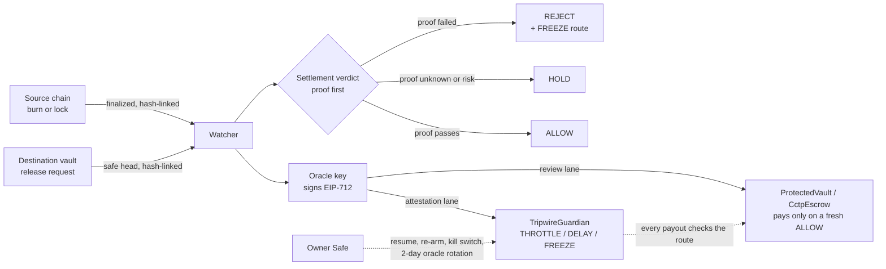

<p align="center">
  
</p>

<h1 align="center">Retold · Tripwire</h1>

<p align="center">
  <strong>Read any wallet. Protect every bridge.</strong><br />
  A settlement firewall that stops a bridge drain <em>before</em> the payout executes,<br />
  and a wallet reader that explains every transaction in plain English.
</p>

<p align="center">
  <a href="https://chainstory-iota.vercel.app/tripwire?incident=kelp"><strong>▶ Tripwire replay</strong></a> ·
  <a href="https://chainstory-iota.vercel.app/check"><strong>▶ Check before you sign</strong></a> ·
  <a href="https://chainstory-iota.vercel.app/app"><strong>▶ Retold app</strong></a> ·
  <a href="#live-on-sepolia-policy-v4">Live on Sepolia</a> ·
  <a href="#we-attacked-our-own-system">Security audit</a> ·
  <a href="#run-it-locally">Run it locally</a>
</p>

<p align="center">
  
  
  
  
  
  
  
</p>

---

## At a glance

| | |
| :--- | :--- |
| **$313.6M → $0** | Three real 2026 bridge exploits (Kelp DAO, Verus, Syscoin) replayed through Tripwire: every drain is stopped before execution |
| **749 tests, 51 suites** | Contracts run in a real EVM, the operator is killed mid-write with SIGKILL, RPCs lie, blocks reorg, and the gas spikes |
| **63 / 63 mutants caught** | Every safety rule in the contracts is deliberately broken by a script, and a test catches each break |
| **11 findings fixed** | We audited our own code, then the merged work of all three contributors; every finding was proven with a failing test, fixed, and kept as a regression test |
| **Live on Sepolia** | Policy v4, every contract verified on Etherscan, the guardian owned by a Safe; the live attack ran NONE → THROTTLE → DELAY → FREEZE |
| **27 decision records** | Every security trade-off is written down in [docs/07-decisions-adr.md](docs/07-decisions-adr.md): context, decision, limits and tests |
| **5 contracts, 916 lines of Solidity** | Small enough to read in one sitting; guardian runtime 9,599 bytes, escrow 10,358 bytes (EIP-170 limit 24,576) |

## Two products, one idea

On-chain data is machine-readable and human-incomprehensible. We built two
tools on that insight:

| | For | What it does |
| :--- | :--- | :--- |
| **[Retold](https://chainstory-iota.vercel.app/app)** | Anyone with a wallet | Paste an address or ENS name: get its history in plain English, a draft Form 8949 tax report, token approvals and a counterparty risk check. **[Check before you sign](https://chainstory-iota.vercel.app/check)**: paste a pending transaction and get a green, yellow or red badge with its reasons. Read-only: no wallet connection, nothing to sign. |
| **[Tripwire](https://chainstory-iota.vercel.app/tripwire)** | Bridge teams | Checks each bridge payout *before* it executes, and tightens just that route in proportion: throttle, delay, or freeze. |

Retold explains what a transaction did, before or after it is signed. Tripwire
applies the same verification before a bridge payout can do damage, and reuses
Retold's contract checks to do it. The rest of this README is about Tripwire;
Retold's full documentation is in [docs/chainstory.md](docs/chainstory.md).

## The problem

On 18 April 2026, $292M left Kelp DAO's bridge. Not over hours: in **a single
release**. Verus lost $11.58M the same way in May, Syscoin ~$10M in June.

Every defence in common use (rate limits, emergency pauses, security councils)
acts **after** a transaction lands. Against a one-transaction drain, that is too
late by definition.

Cross-chain systems can authenticate a *message* and still allow an economically
invalid *outcome*. Tripwire puts one question in front of settlement:

> **Can an independent system prove that the source event behind this payout actually happened?**

```
source burn / lock  →  bridge message  →  TRIPWIRE: verify source + invariants + policy  →  ALLOW / THROTTLE / DELAY / FREEZE  →  settle
```

## The result

We replayed all three exploits through Tripwire's oracle and its guardian
contract. Each release is sent to two deployments at once: one that acts before
execution, one that acts a block later.

| | Verus | Syscoin | Kelp DAO |
| :--- | ---: | ---: | ---: |
| What actually happened | $11.58M | $10M | $292M |
| **Tripwire, before execution** | **$0** | **$0** | **$0** |
| Tripwire, one block later | $11.58M | $10M | $292M |

The last row is shown on purpose. It is the whole argument: for these attacks,
a breaker acts before execution or it does not act at all.

**[Watch it happen →](https://chainstory-iota.vercel.app/tripwire?incident=kelp)**
The dashboard runs the exact contract bytecode the tests run, in your browser,
and a test fails if they ever differ.

## How it works



1. **Watch.** Source events are read only from finalized blocks and release
   requests from the `safe` head, both through hash-linked checkpoints. A reorg
   past either quarantines the operator instead of guessing.
2. **Decide.** One pure function, `settlementVerdict`, decides every release.
   **Proof checks** (is the source event authenticated and final, does it back
   this exact amount) can REJECT. **Safety checks** (route policy, oracle
   health, counterparty screening, behavioural score) can only HOLD. Suspicion
   never rejects, and missing evidence never becomes permission.
3. **Sign.** The oracle key signs an EIP-712 attestation (route tier) and a
   per-release review (ALLOW / HOLD / REJECT). Both are bound to chain and
   contract, single-use and valid for at most 10 minutes.
4. **Enforce on-chain.** The guardian tightens just that route; the vault pays
   only after a fresh ALLOW, and only through the guardian.

### What the oracle checks

| Rule | Catches | Kind |
| :--- | :--- | :--- |
| **Payout vs burn** | Money released that was never burned on the source chain, or more than was burned, compared in exact token base units | Proof: rejects |
| **Size vs baseline** | A release far outside what the route normally does (rolling baseline from finalized source burns) | Estimate |
| **Withdrawal velocity** | A burst that drains the pool under a per-transfer cap | Estimate |
| **Counterparty** | A recipient already tied to a hack or sanctions | Proof, when flagged |
| **Receiving contract** | Money sent to a contract that is unverified, days old and upgradeable, read from the explorer by Retold's contract check | Estimate: alone, at most THROTTLE |

One strong suspicion throttles; two independent ones (a drain-profile contract
*and* an anomalous size or burst) delay; proof freezes. The first rule catches
all three incidents from their reported mechanism alone: Verus paid out **965×**
the burn; Syscoin and Kelp paid out against **no verifiable burn at all**.

### The guardian's tiers

| Score | Tier | Effect on that route only |
| :--- | :--- | :--- |
| ≥ 0.65 | THROTTLE | The rolling cap is halved |
| ≥ 0.85 | DELAY | Cap stays halved; outflows totalling more than 10% of the cap since DELAY began wait 30 minutes |
| ≥ 0.95 | FREEZE | Every outflow reverts |

Tiers only escalate while active and expire after 24 hours. The oracle alone can
hold a route for at most **72 hours**; after that a human must re-arm it.

## Defence in depth

| Layer | What it guarantees |
| :--- | :--- |
| **TripwireGuardian** (on-chain) | Per-route tiers, escalate-only, 24 h expiry, 72 h oracle span; a conservative rolling cap in 17 buckets; only allow-listed vaults may report outflows, per route |
| **Release gate** (`ProtectedVault`, `CctpEscrow`) | Every payout needs a fresh oracle-signed ALLOW bound to message, route, token, recipient, exact amount, minimum tier, nonce and expiry; older reviews can never override newer ones; a REJECT is a 7-day hold |
| **CCTP v2 escrow** | Credits are created only from an authenticated Circle mint in the same transaction, for the exact net amount and the hook's beneficiary; the escrow owns itself |
| **Threshold oracle** (`TripwireQuorum`) | k-of-n ERC-1271 signer set with an honest-majority rule; membership changes need the quorum itself and are epoch-bound |
| **Settlement verdict** | Proof first; a failed proof rejects and freezes, suspicion only holds; per-route policy can only tighten |
| **Independent verification** | Source proofs are read through independently operated RPC providers that must agree; one dissent holds the release |
| **Durable operator** | Write-ahead transaction journal (signed bytes saved before broadcast), SQLite state with a process lease, finality tracking, reorg quarantine, crash recovery tested with real SIGKILL |
| **Keys** | An owner Safe, a signing-only oracle key, and two relayers on separate nonce lanes; the deploy and the operator refuse a single shared key |

### Built to fail safe

| Role | Can | Cannot |
| :--- | :--- | :--- |
| **Oracle key** | Tighten one route; sign reviews | Move funds, raise a cap, loosen a tier, resume a route, hold a route past 72 h |
| **Owner (a Safe)** | Resume, re-arm, switch the oracle off instantly | Replace the oracle without **two days' public notice**; raise a cap while the route is protected |
| **Relayers** | Pay gas and submit signed messages | Forge anything: every attestation and review is authenticated by its signature, not its sender |

A stolen oracle key means a slowdown or a pause on the routes it attests against,
never a theft. The oracle never fakes confidence: a missing price or a stale
baseline returns `indeterminate`, not a low score. A breaker that fails open is
worse than none, because it is trusted.

## We attacked our own system

Before calling it done, we audited the full stack ourselves (head `0134301`),
proved each finding with a test that **passed while the bug existed**, fixed it,
and kept that test, inverted, as a permanent regression guard
([`auditRegression.evm.test.ts`](contracts/evm/test/auditRegression.evm.test.ts),
[`auditRegression.test.ts`](scripts/tripwire/__tests__/auditRegression.test.ts)).
The fixes ship as **policy v4** ([ADR-024 to ADR-027](docs/07-decisions-adr.md)).

| ID | What we found | Proven by | Fixed by |
| :--- | :--- | :--- | :--- |
| **CRIT-1** | The guardian owner could make itself the oracle in one transaction, lift a FREEZE, raise the cap, approve its own release and drain the route | PoC drained a frozen 5,000,000-unit pool in consecutive transactions | `setOracle` removed. Replacement needs `proposeOracle` → `acceptOracle` after **2 days**; `disableOracle` is instant; no cap raise while protected; the owner is a Safe and the oracle a separate key |
| **CRIT-2** | One REJECT permanently stranded fully backed, Circle-minted USDC in the escrow | PoC: a later ALLOW failed, the beneficiary received 0 | A REJECT is a **7-day hold**; afterwards only fresh evidence that passes every check can reopen it, and it can still pay only the authenticated beneficiary |
| **HIGH-1** | One underpriced review transaction blocked every later transaction, the FREEZE included | PoC: FREEZE never sent; recovery rebroadcast identical bytes forever | Attestations get their **own relayer, nonce lane and journal**; stuck transactions are re-signed with ≥ 10% higher fees, journaled before broadcast, up to a fee ceiling |
| **HIGH-2** | The live operator had no baseline, so it held every honest payout | Code path: no baseline was ever computed | **Rolling baseline** from finalized source burns, which cannot deadlock a new route |
| **HIGH-3** | The oracle could keep a route frozen indefinitely by refreshing | PoC held a route frozen for 161 hours | Oracle protection capped at **72 hours**, a 24 h cooldown between spans, a human re-arm for real incidents |
| **MED-1** | DELAY could be bypassed by splitting a payout into tenths | PoC: 4 × 10% passed where 40% was held | DELAY now counts **everything paid since it began** |
| **MED-2** | End-to-end latency of many minutes | Measured: scoring is ~0.14 ms, the pipeline is the bottleneck | Release requests read at the `safe` head; recipient lookups 4 at a time with a cache; held releases back off |
| **MED-3** | A single RPC endpoint | One URL, no failover | Ordered failover across several RPC URLs |
| **MED-4** | A 1% over-claim passed the backing check | Symmetric tolerance | **Exact, one-sided** check: a payout may never exceed its burn by one base unit |
| **MED-5** | Docs presented k-of-n signing as live | Code review | Claims aligned with the code; see [Honest limits](#honest-limits) |
| **INT-1** | Found when the three contributors' branches were reviewed together: the kill switch did not cancel a pending oracle rotation, so anyone could accept it once its notice ended and quietly undo the switch | Test and mutant: accepting after `disableOracle` must fail | `disableOracle` now cancels any pending rotation; re-enabling always takes a fresh proposal and the full two days |

Every contract change is also covered by the mutation suite: **63 deliberately
broken versions of the contracts, 63 caught**, 15 of them added since policy v4.

## Live on Sepolia (policy v4)

Deployed 3 October 2026 with separate keys for every role. Every contract
except the attacker's is source-verified on Etherscan, and the guardian is owned
by a Safe (`owner()` returns the Safe, `pendingOwner()` is empty).

| Contract | Role | Address |
| :--- | :--- | :--- |
| TripwireGuardian | The circuit breaker, policy v4 | [`0xF58C…fE0F`](https://sepolia.etherscan.io/address/0xF58C0711Fed0F425383E5D07345880488889fE0F#code) |
| ProtectedVault | The bridge's payout end; pays only on a fresh ALLOW, through the guardian | [`0xac35…05eE`](https://sepolia.etherscan.io/address/0xac351d48Ff418c0f4bdbfC0F1E6eb4597e3b05eE#code) |
| MockSourceBridge | The bridge's source end; records burns | [`0x09a3…B617`](https://sepolia.etherscan.io/address/0x09a3fD1D69449D83A67660788DDF3D553A55B617#code) |
| DemoUSDC | The token the vault pays out | [`0xeF13…Ba30`](https://sepolia.etherscan.io/address/0xeF1371076d0A6183C90482f35fbc598864e2Ba30#code) |
| Attacker's contract | Fresh, unverified, upgradeable (ERC-1967 proxy), on purpose | [`0xB5a9…E7FA`](https://sepolia.etherscan.io/address/0xB5a9A61C6d956a785A5d935382152105310dE7FA) |

| Role | Address | Holds |
| :--- | :--- | :--- |
| Owner | [Safe `0x65DC…3D0C`](https://sepolia.etherscan.io/address/0x65DC895a989a8Ac3ef4Df7Eb1B968732c1fc3D0C) | Guardian ownership: resume, re-arm, kill switch, 2-day oracle rotation |
| Oracle | [`0xD35B…EF9E`](https://sepolia.etherscan.io/address/0xD35BCB9d7FD2350DEcca4204cF6dE105fDB2EF9E) | Signs attestations and reviews; holds no ETH, sends nothing |
| Relayer | [`0xbe04…a36F`](https://sepolia.etherscan.io/address/0xbe04Fd4De57E930901f97F568BD2a12c3145a36F) | Deployed the contracts; pays for reviews and payouts |
| Attestation relayer | [`0x4B5d…8928`](https://sepolia.etherscan.io/address/0x4B5ddA9F7BE7d915957e95ab2EFF680fCD408928) | Pays for attestations on its own nonce lane |

The live run, step by step. Open the guardian's and the vault's transaction
lists to see each attestation and each blocked payout.

| Step | What happens | Score | Guardian tier |
| :--- | :--- | ---: | :--- |
| 0 | Three ordinary payouts, each backed by a burn: all paid | 0.00 | NONE |
| 1 | A payout to the attacker's contract: fresh, unverified, upgradeable | 0.65 | **THROTTLE**: cap halved, still paid |
| 2 | A 900,000 payout to the same contract, 10× the route's usual size | 0.85 | **DELAY**: held; an honest 40,000 payout in the same minute is paid |
| 3 | A forged 11,580,000 payout with no burn behind it | 1.00 | **FREEZE + REJECT**: blocked (`ReleaseRejected`) |

The route is now frozen, and only the owner Safe can lift it early: exactly the
point of the new key model. This guardian was deployed before the INT-1 kill-switch
fix; until a redeploy, its Safe batches `cancelOracleRotation` with `disableOracle`
if a rotation is ever pending ([runbook](docs/plans/tripwire-operator.md#redeploy-policy-v4-to-sepolia)). The previous single-key deployment
([`0x6d01…b61f`](https://sepolia.etherscan.io/address/0x6d01c906fa1615791641e17aca615f53885db61f)) is retired; the v4 operator and demo refuse it.

## Proof it works

| Check | Result |
| :--- | :--- |
| Guardian executed in a real EVM | 58 / 58 tests |
| Audit findings reproduced, then fixed: CRIT-1/2, HIGH-1/3, MED-1 | 15 regression tests |
| Oracle and contract agree at every tier boundary (64/65, 84/85, 94/95) | 12 cross-layer tests |
| Incident replays, end to end | 41 tests |
| Watch → attest → guardian loop, tier asserted after each step | 6 tests |
| Signed release gate: field/domain binding, replay/order, expiry, key rotation, rejection hold, required protection | 23 tests |
| Watcher retry, missing/conflicting source data, deduplication and acknowledgement | 11 tests |
| RPC/decode cursor recovery, bounded catch-up and old-deployment refusal | 4 tests |
| Durable state, SIGKILL, transaction inclusion/finality recovery and HOLD/delay queue | 49 tests |
| Finalized log/provenance, canonical headers/checkpoints, receipt finality and signing guard | 21 tests |
| CCTP v2 USDC: exact escrow backing, identity/fee binding, replay, durable claims and quarantine | 45 tests |
| Authenticated CCTP escrow: atomic net mint/credit, self-ownership, rollback, receipt identity and deployment bindings | 74 tests |
| Protection refresh: expiry/restart, chain clock, concurrent calls, key rotation, 72 h span, stale risk and RPC/quarantine failures | 28 tests |
| Route isolation, rolling caps, request delay and historical review policy | 42 tests |
| Policy v4: oracle rotation, REJECT hold, relayer lanes, fee bumping, key roles, rolling baseline, safe-head feeds | 81 new tests (665 → 746) |
| Integration review of all branches: kill switch cancels a pending rotation, a landed rotation never honours old allowances, the attestor stops after a rotation | 3 tests |
| Check before you sign, incl. "nothing reachable from /check can sign" | 40 tests |
| Guardian, release-review, quorum and CCTP rules broken on purpose (`npm run test:mutants`) | **63 / 63 mutants caught** |
| Gas: check an outflow · accept an attestation | 79.0k · 88.3k |
| **Total** | **749 tests passing** |

## Honest limits

- **Tripwire must see the release before it executes**: through the bridge's
  relayer, or the public mempool. An attacker using private orderflow bypasses
  the mempool path; the relayer hook is the answer.
- **Pausing has a cost.** In the replays, 5–7 legitimate withdrawals wait for
  review. The dashboard shows it.
- **The replays are reconstructions** of what each attack looked like to the
  bridge, not real transaction hashes. Every sourced fact and every assumption
  is listed separately on the page.
- **The Sepolia bridge is a demo.** Both ends are on Sepolia and the attack is
  scripted. The mock bridge's burns are not cryptographic proofs, so the
  long-running operator correctly holds its payouts; the CCTP v2 route has real
  proofs but is tested on synthetic fixtures until a live pilot.
- **One oracle key.** The contracts already accept a k-of-n `TripwireQuorum`,
  but its members do not yet run on separate machines, so the live operator
  signs with one key, behind the 2-day rotation and the Safe's kill switch.
- **Our audit is not an external one.** It found and fixed ten issues; an
  independent review is still the next step before mainnet.

## Run it locally

```bash
git clone https://github.com/shokkanuly/Chainstory.git
cd Chainstory
npm install
npm run dev                    # Retold at /app and /check, Tripwire at /tripwire
npm test                       # 749 tests
npm run test:mutants           # 63 broken contract variants, each must be caught
npm run demo:attack            # the four-step attack against real bytecode in a local EVM, ~2 s
```

No API keys are needed for the Tripwire replay or the local demo. Retold needs
an `ETHERSCAN_API_KEY` for live wallet data; see [`.env.example`](.env.example).
AI descriptions are off unless you switch them on in the app.

**Deploy your own:** put one key per role and your Safe's address in
`.env.tripwire` (git-ignored), then `npm run tripwire:deploy`,
`tripwire:verify` and `tripwire:demo:sepolia`. The deploy refuses a single
shared key and an owner that is not a contract. Step-by-step:
[operator runbook](docs/plans/tripwire-operator.md#redeploy-policy-v4-to-sepolia).

## Repository

| Path | What |
| :--- | :--- |
| [`contracts/evm/`](contracts/evm/) | TripwireGuardian, ProtectedVault, CctpEscrow and TripwireQuorum in Solidity; EVM tests; the mutation runner |
| [`scripts/tripwire/`](scripts/tripwire/) | The watcher, settlement verdict, attestor, durable sender, operator, and the Sepolia deploy / verify / demo / operator |
| [`src/tripwire/`](src/tripwire/) | The risk oracle and the in-browser guardian |
| [`src/tripwire/replay/`](src/tripwire/replay/) | The three incidents and the replay engine |
| [`src/components/tripwire/`](src/components/tripwire/) | The `/tripwire` dashboard |
| [`src/chains/evm/`](src/chains/evm/) | Pure EVM codecs, including CCTP v2 message decoding |
| [`src/services/preSignCheck.ts`](src/services/preSignCheck.ts) | Check before you sign, at `/check` |
| [`src/pages/Workspace.tsx`](src/pages/Workspace.tsx) | Retold, the wallet analyser at `/app` |
| [`api/`](api/), [`server/`](server/) | Retold's stateless API proxy; keeps explorer keys server-side |

| Document | Read it for |
| :--- | :--- |
| [Decision records](docs/07-decisions-adr.md) | 27 ADRs: every trade-off, its limits and its tests |
| [Settlement firewall build map](docs/plans/tripwire-settlement-firewall.md) | How each part of the brief maps to code, and what is still open |
| [Operator runbook](docs/plans/tripwire-operator.md) | Keys, lanes, fees, recovery, and the exact redeploy steps |
| [CCTP runbook](docs/plans/tripwire-cctp.md) | The Circle CCTP v2 adapter and escrow |
| [Architecture](docs/02-architecture.md) · [Roadmap](docs/05-roadmap.md) | Layers and boundaries; status of every milestone |

## Built vs roadmap

| | Built and tested | Roadmap |
| :--- | :--- | :--- |
| Retold | Wallet stories, draft Form 8949, approvals, contract risk, Check before you sign, opt-in AI wording | Solana analysis in the app (adapters exist, not wired in) |
| Tripwire oracle | Five rules, graduated tiers, `indeterminate` when blind, rolling baseline from finalized burns, proof-first verdict | A trained model |
| Guardian | THROTTLE / DELAY / FREEZE, escalate-only, 24 h expiry, 72 h oracle span, time-locked oracle rotation, kill switch; **policy v4 live on Sepolia, owned by a Safe** | External audit; mainnet; a Solana (Anchor) guardian |
| Operations | Durable journal, finalized and safe-head feeds, reorg quarantine, multi-RPC proof agreement, separate key roles and nonce lanes, fee-bumped replacement, RPC failover, authenticated CCTP v2 escrow | Live CCTP pilot; quorum members on separate machines |
| Further ideas | | zkML proofs of the score (EZKL), a sentinel network, bounties for reporters |

## Sources

Checked 25 September 2026.

- [Chainalysis: KelpDAO bridge exploit](https://www.chainalysis.com/blog/kelpdao-bridge-exploit-april-2026/)
- [The Crypto Times: Bridge hacks top $328M in 2026](https://www.cryptotimes.io/2026/05/18/crypto-bridge-hacks-top-328m-in-2026-as-cross-chain-exploits-accelerate/)
- [Syscoin: Technical postmortem](https://syscoin.org/news/technical-postmortem-syscoin-bridge-incident-recovery-and-remediation)

## License

MIT
